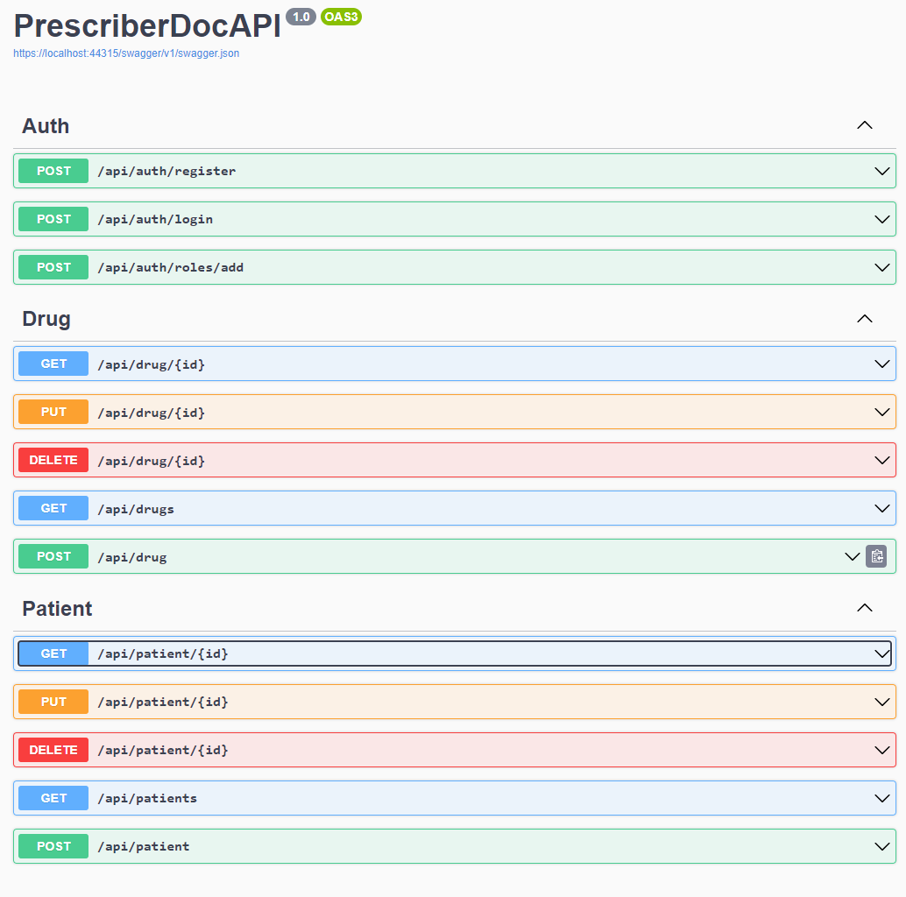
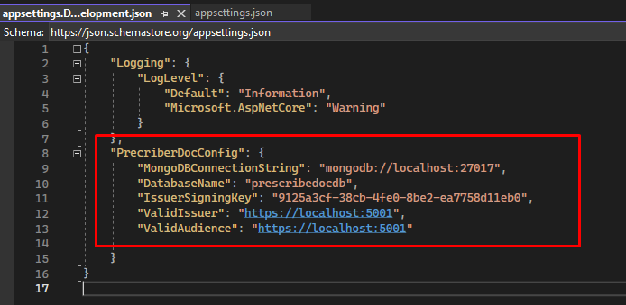
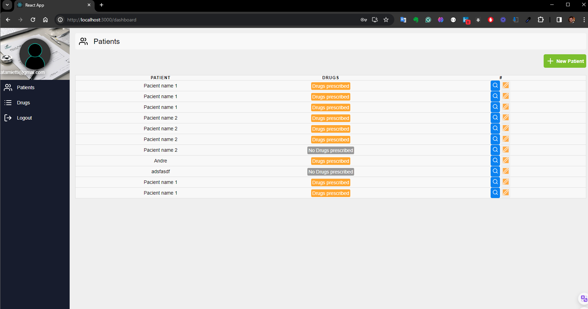
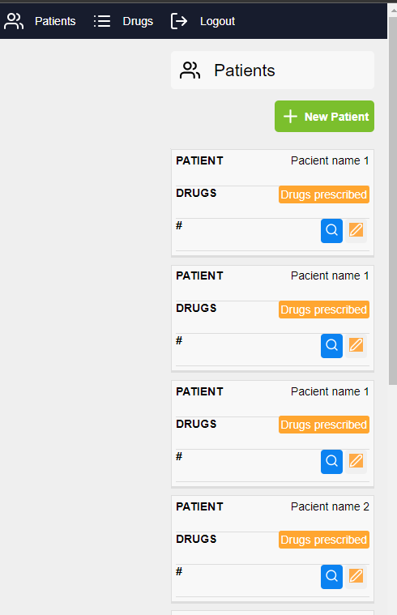
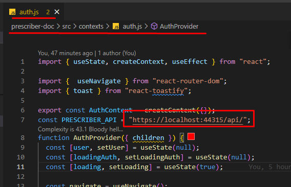

# Prescriber Doc

## User Story
<a href="docs/UserStory.pdf">See User story documentations</a>

## About API

Using  C# Generics with assembly, we have an excellent way to generate WebApis dynamically. 

So if a new model/entity was necessary to be exposed as crud API, we just needed to create a new class inheriting from <strong>CrudBase</strong>, and the magic happens.
<strong> Example: </strong>
</br>
```
public class Drug : CrudBase
{
    [JsonPropertyName("IdentificationDrugID")]
    public override string Identification { get => base.Identification; set => base.Identification = value; }
    public string Description { get; set; } = string.Empty;
    public string Company { get; set; } = string.Empty;
    public string Dosage { get; set; } = string.Empty;
}

```
</br>

</br>

## Setup API
To run the project, you will need to set up the AppSettings file.
</br>

</br>


## About FRONT 

Using React Redux the project was built in the responsive mode
</br>

</br>
</br>

</br>


## Setup FRONT
To run the project, you will need to set up the auth.js file 
</br>

</br>

